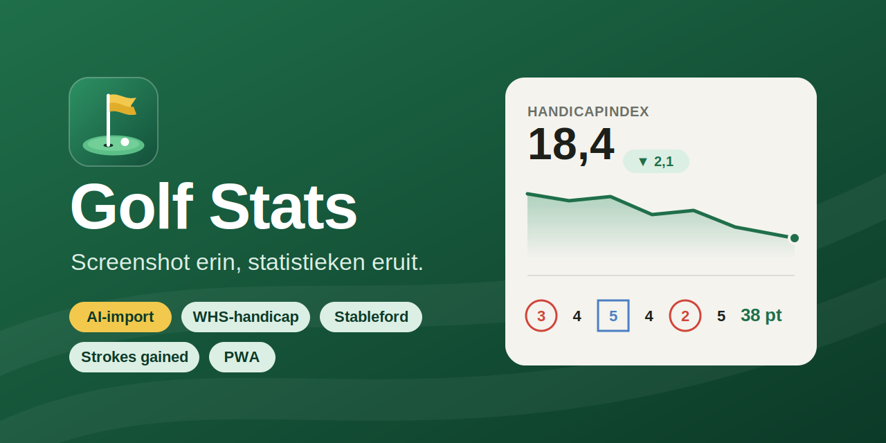
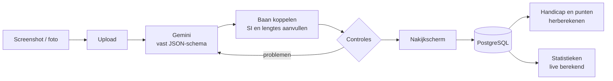

<div align="center">



# Golf Stats

**Screenshot erin, statistieken eruit.**
Een persoonlijke, mobile-first golf-app die je Hole19-screenshot of scorekaartfoto met AI uitleest en omzet in stableford, WHS-handicap en strokes gained.

[](https://github.com/Bedrijfstak14/golf-stats/actions/workflows/ci.yml)
[](https://github.com/Bedrijfstak14/golf-stats/actions/workflows/codeql.yml)
[](https://scorecard.dev/viewer/?uri=github.com/Bedrijfstak14/golf-stats)


[](LICENSE)

</div>

---

## Wat het doet

| | |
|---|---|
| 📸 **AI-import** | Upload een Hole19-screenshot of een foto van een papieren kaart. Gemini leest hem uit in een vast JSON-schema. Kloppen de controles niet, dan krijgt de AI één herkansing met de gevonden problemen als feedback. |
| ✅ **Nakijkscherm** | De kaart naast de uitgelezen scores. Alle controles draaien live mee (totalen, stableford, plausibiliteit), dus je ziet meteen wat niet klopt. |
| 🏌️ **WHS-handicap** | Course- en playing handicap, adjusted gross score, differentials, 9-holesaanvulling, soft en hard cap, correctie bij uitzonderlijke scores, en *"Wat moet ik scoren?"* |
| 📊 **Statistieken** | Trends, patronen en records per baan, hole-type en periode. Alles wordt live berekend uit je holescores en nergens apart opgeslagen. |
| 🎯 **Strokes gained** | Per slag vastleggen en zien waar je slagen wint of verliest: off the tee, approach, rond de green en putten. |
| 📱 **PWA** | Installeerbaar op je telefoon. Deel een screenshot direct vanuit je galerij (share target), bekijk rondes offline, en wat je offline opslaat wordt later verstuurd. |
| 👥 **Multi-user** | Een eigenaarsaccount plus spelers via uitnodigingslinks. Banen worden gedeeld, rondes en statistieken zijn per speler. |

> Handicap en punten komen altijd uit de eigen database, nooit van de kaart. Rondes bewaren een momentopname van par, SI, CR en slope, zodat latere baanwijzigingen de geschiedenis niet herschrijven.

## Snel starten

```bash
git clone https://github.com/Bedrijfstak14/golf-stats.git && cd golf-stats
cp .env.example .env        # vul POSTGRES_PASSWORD en GEMINI_API_KEY in
docker compose up -d --build
```

Open `http://localhost:3470/setup` en maak het eigenaarsaccount aan. Daarna kun je je alleen nog registreren via een uitnodigingslink (menu → Spelers en uitnodigingen). Migraties draaien automatisch bij het opstarten.

<details>
<summary><b>Productie: HTTPS, tunnel, backups en limieten</b></summary>

- **Poort**: de app luistert op `0.0.0.0:${APP_PORT:-3470}`. Met `APP_BIND=127.0.0.1` is hij alleen op de server zelf bereikbaar. Zet `APP_URL` op het adres waarmee je de app opent, dan kloppen de uitnodigingslinks.
- **HTTPS**: zet je eigen reverse proxy voor poort 3470, of start de meegeleverde Caddy met `docker compose --profile proxy up -d` (vereist `DOMAIN` en vrije poorten 80/443). De proxy moet uploads tot ongeveer 50 MB toestaan.
- **Cloudflare tunnel**: zet `APP_URL` op het publieke https-adres en bouw opnieuw met `docker compose up -d --build`, zodat het domein is toegestaan voor server actions. Het inlogcookie wordt `Secure` zodra een verzoek via https binnenkomt (`X-Forwarded-Proto`), dus http op het LAN blijft werken.
- **Backups**: de `backup`-container maakt bij de start en daarna elke nacht om 03:00 een `pg_dump` plus een tar van de afbeeldingen in `./backups`, en bewaart die 30 dagen.
- **AI-kosten**: `GEMINI_MAX_PER_DAY`, `GEMINI_MAX_PER_MONTH`, `GEMINI_MAX_PER_USER_DAY` en `GEMINI_MAX_PER_IMPORT` begrenzen het aantal Gemini-aanroepen. Het verbruik staat onder Instellingen.
- **`.env`**: Docker Compose leest een `$` in een waarde als variabele. Gebruik `$$` of vermijd `$` in wachtwoorden.

</details>

## Ontwikkelen

```bash
npm install
docker run -d --name golf-stats-devdb -e POSTGRES_USER=golf -e POSTGRES_PASSWORD=golf -e POSTGRES_DB=golf -p 127.0.0.1:5439:5432 postgres:16-alpine
npm run dev          # http://localhost:3470
npm test             # rekenregels: stableford, controles, WHS, stats, strokes gained
npm run typecheck
npm run db:generate  # na wijzigingen in src/db/schema.ts
```

## Hoe het in elkaar zit



| Pad | Inhoud |
|---|---|
| `src/lib/golf/` | Losse, geteste rekenmodules zonder database: `stableford`, `checks`, `whs` (alle WHS-regels op één plek), `stats`, `strokesGained` en `aiDraft` (AI-JSON naar conceptronde) |
| `src/lib/gemini.ts`, `aiBudget.ts` | Gemini-aanroep met vast JSON-schema, en het kostenbudget dat elke aanroep eerst reserveert |
| `src/lib/rounds.ts`, `courses.ts`, `imports.ts` | Rondes opslaan en laden, banen koppelen en aanmaken, uploads verwerken |
| `src/components/RoundEditor.tsx` | Het ene nakijkscherm, voor import, handmatige invoer en bewerken |
| `src/db/schema.ts` | Datamodel (Drizzle), multi-user vanaf dag één |
| `public/sw.js`, `src/app/manifest.ts` | PWA: offline, share target en een wachtrij voor opslaan zonder netwerk |

Stack: **Next.js 15** (App Router) · **React 19** · **TypeScript** · **Drizzle ORM** · **PostgreSQL 16** · **Gemini** · **Vitest** · **Docker Compose**

## Keuzes en beperkingen

- **De handicap is indicatief.** De NGF-registratie blijft leidend. De index is het gemiddelde van de beste 8 van de laatste 20 differentials. Bij minder rondes geldt de WHS-tabel. De 9-holesaanvulling is 0,52 × index + 1,197. Verder: soft en hard cap, maximaal 54, en PCC standaard 0.
- **Strokes gained** gebruikt een benadering van de PGA Tour-baseline (Broadie). De niveaus per handicap zijn daarvan afgeleid door te schalen.
- **CSV-import** gebruikt voorlopig het eigen exportformaat.
- **Passkeys** zitten er nog niet in. Inloggen gaat met e-mail en wachtwoord.

## Beveiliging

Heb je een kwetsbaarheid gevonden? Meld die privé via [SECURITY.md](SECURITY.md) en niet via een openbare issue.

## Licentie

[MIT](LICENSE): vrij te gebruiken, aan te passen en te delen, zolang de licentie en de copyrightvermelding erbij blijven.
